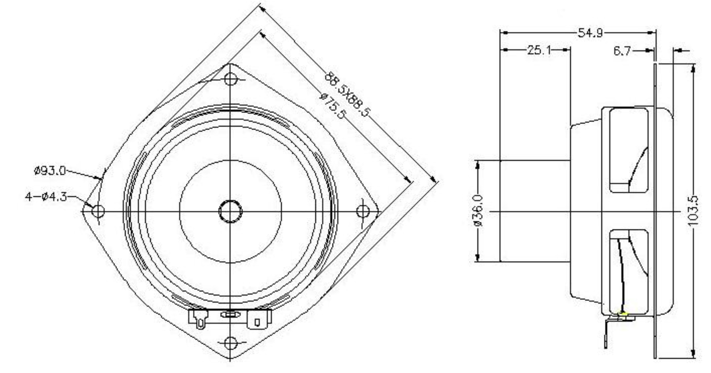
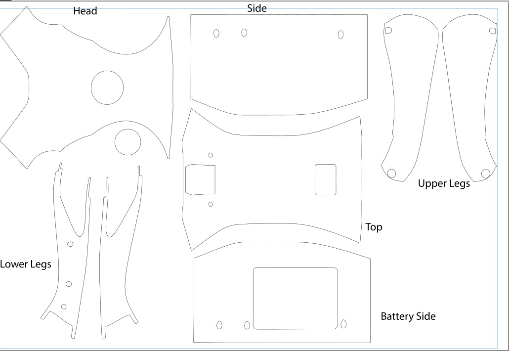

# bff-solids
cad models and others for the bff project https://roberttwomey.com/bff

## 3D Parts

## Jetson Nano Mount and Power Systems

### STL Files - Jetson Nano and Power Parts
- [`jetson-plate3.stl`](jetson-nano-and-power/jetson-plate3.stl)
- [`power-2.stl`](jetson-nano-and-power/power-2.stl)
- [`spacer1.stl`](jetson-nano-and-power/spacer1.stl)
- [`spacer2.stl`](jetson-nano-and-power/spacer2.stl)

### Rhino Files - Jetson Nano and Power Parts
- [`jetson-plate3-rail-jetson5.3dm`](jetson-plate3-rail-jetson5.3dm)

## Speaker Assembly

### STL Files - Speaker
- [`speak3-back-2.stl`](speaker/speak3-back-2.stl)
- [`speak3-front.stl`](speaker/speak3-front.stl)

### Rhino Files - Speaker
- [`speaker.3dm`](speaker/speaker.3dm)

## Aurasound 3 Inch Driver

Datasheet - [assets/aurasound-ns3-193-8a.pdf](assets/aurasound-ns3-193-8a.pdf)

## 2D Designs
### Vinyl Wrap

### SVG File - Vinyl Wrap
- [`unitree-go2-vinyl-wrap.svg`](unitree-go2-vinyl-wrap.svg) (inkscape)

# References
- Vinyl Wrap Sources - [TK]
- Unitree GO2 Top Rails Source - [TK]

## Unitree Go2 Model
- [Unitree 3D Model](https://github.com/unitreerobotics/unitree_model/tree/main)
- [Unitree User Manual](https://github.com/unitreerobotics/GO2/blob/main/GO2%20Manual/GO2%20Manual/GO2%20User%20Manual_V1.3%20EN.pdf)
- [Sketchfab Model](https://sketchfab.com/3d-models/robot-dog-unitree-go2-7af84eb9ba834f27bbac818a8b96e2da)