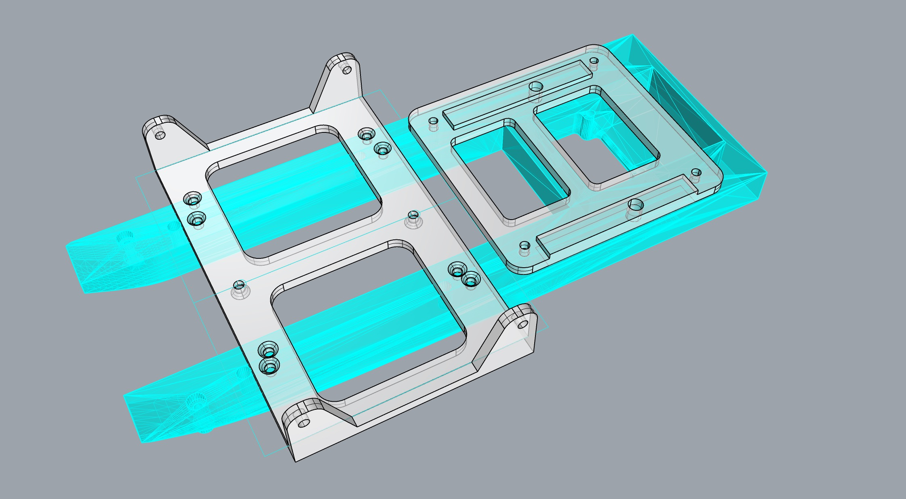
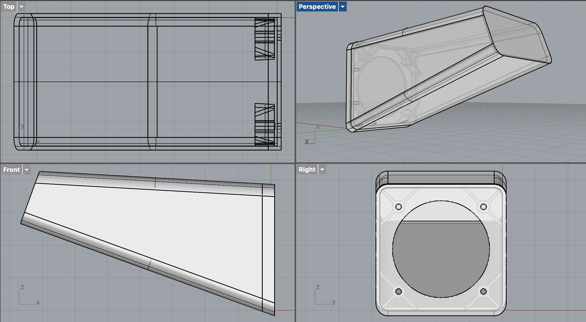

# bff-solids
cad models and others for the bff project https://roberttwomey.com/bff

## Assembly Previews

### Jetson Mounts & Power

### Speaker Assembly

### Vinyl Wrap

## STL Files

### Jetson Nano and Power Parts
- [`GO2_handleClip_ETH_POW.stl`](jetson-nano-and-power/GO2_handleClip_ETH_POW.stl)
- [`Unitree_Go2_Base_Rail_v2.stl`](jetson-nano-and-power/Unitree_Go2_Base_Rail_v2.stl)
- [`jetson-plate3.stl`](jetson-nano-and-power/jetson-plate3.stl)
- [`power-2.stl`](jetson-nano-and-power/power-2.stl)
- [`spacer1.stl`](jetson-nano-and-power/spacer1.stl)
- [`spacer2.stl`](jetson-nano-and-power/spacer2.stl)

### Speaker Parts
- [`speak3-back-2.stl`](speaker/speak3-back-2.stl)
- [`speak3-front.stl`](speaker/speak3-front.stl)

## Rhino Source Files
- [`jetson-plate3-rail-jetson5.3dm`](jetson-plate3-rail-jetson5.3dm)
- [`speaker.3dm`](speaker/speaker.3dm)

## 2D Designs
### Unitree Go2 Vinyl Wrap
- [`unitree-go2-vinyl-wrap.svg`](unitree-go2-vinyl-wrap.svg)

# References

## Unitree Go2 Model
- [Unitree 3D Model](https://github.com/unitreerobotics/unitree_model/tree/main)
- [Unitree User Manual](https://github.com/unitreerobotics/GO2/blob/main/GO2%20Manual/GO2%20Manual/GO2%20User%20Manual_V1.3%20EN.pdf)
- [Sketchfab Model](https://sketchfab.com/3d-models/robot-dog-unitree-go2-7af84eb9ba834f27bbac818a8b96e2da)